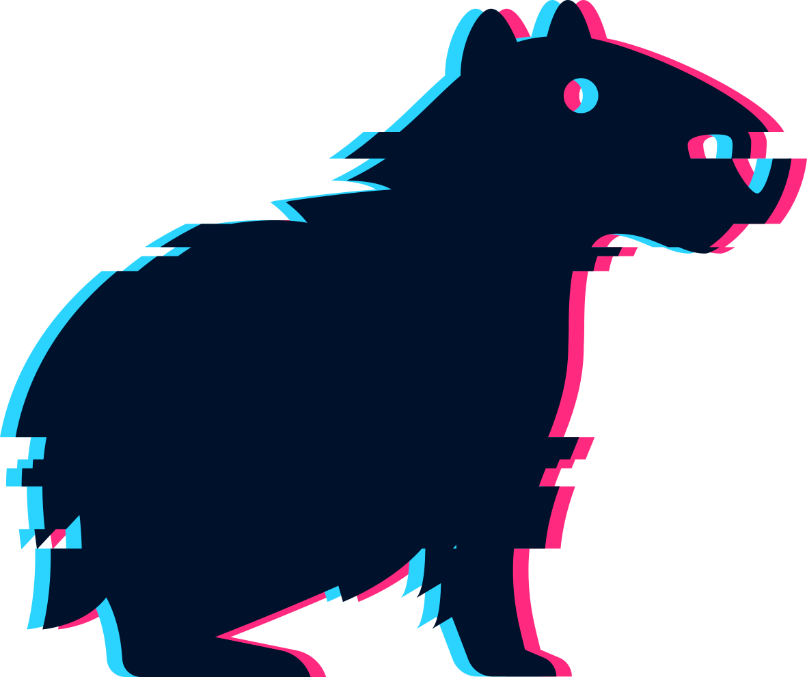

# Hackathon: Ciencia comunitaria y NaturalistaUY

Esta Hackathon es un minicurso del [Congreso Uruguayo de Zoología](https://cuz.szu.org.uy), a desarrollarse en Montevideo entre el 3 y el 8 de diciembre 2023.

  - **Docentes**: Dra. Florencia Grattarola (responsable), Dra. Lucía Rodríguez-Trictot y MSc. Juan Manuel Barreneche.  
  - **Dirigido a**: interesados/as en el análisis de datos de biodiversidad con conocimiento básico de R.  
  - **Cupo**: 20 personas.  
  - **Requisitos**: laptop con [R y RStudio instalado](https://datacarpentry.org/R-ecology-lesson/index.html#install-r-and-rstudio).  

## Resumen 

iNaturalist es una de las plataformas digitales globales de ciencia comunitaria más importantes del mundo y NaturalistaUY es nuestro portal nacional en Uruguay. Este taller tiene como objetivo introducir a las personas a la ciencia comunitaria y el uso de la plataforma NaturalistaUY y proporcionar herramientas para el análisis de los datos. Tendrá una parte introductoria sobre la ciencia comunitaria y el uso de los datos derivados de estas plataformas, y una segunda parte práctica en la que primero se mostrará las funcionalidades de NaturalistaUY y herramientas útiles para el análisis de datos, y se cerrará con una hackathon de datos en R que buscará responder algunas preguntas a partir de los datos generados en Uruguay durante la Gran Biobúsqueda del Sur (GBS). Cada grupo hará foco en responder preguntas como:  

  - ESPECIES: ¿Cuántas especies se registraron? ¿Qué grupos taxonómicos fueron más comunes? ¿Se registraron especies nuevas para Uruguay? y ¿para la plataforma? ¿Se registraron especies amenazadas a nivel local o mundial?  
  - LOCALIDADES: ¿Cuáles fueron las especies más registradas en cada departamento? ¿Coincide esto con tendencias previas?  
  - USUARIOS/AS: ¿Cuántas personas se unieron a iNat por este evento? ¿Cuántas especies registró en promedio cada persona?  

## Programa tentativo

### Día 1 (martes de 8:30 a 10)

| **Bloque** 	| **Actividad** 	| **Tiempo estimado** 	|
|---	|---	|---	|
| Introducciones 	| Presentación de docentes y estudiantes (menti) 	| 10 minutos 	|
| Introducción teórica 	| Datos abiertos, ciencia abierta y ciencia comunitaria. NaturalistaUY, el portal de iNaturalist para Uruguay. ¿Qué es una Hackathon? 	| 30 minutos 	|
| Práctica: NaturalistaUY 	| Cómo explorar datos en la plataforma: Búsquedas por taxones, lugares, proyectos. Cómo descargar datos de la plataforma: Ejemplo Gran Biobúsqueda del Sur (GBS) 2023 	| 20 minutos 	|
| Práctica: R 	| Análisis de datos en R, con RStudio y tidyverse: Lectura de datos (readr). Generación de tablas de resúmenes de datos (dplyr, knitr) 	| 30 minutos 	|

### Día 2 (miércoles de 8:30 a 10)

| **Bloque** 	| **Actividad** 	| **Tiempo estimado** 	|
|---	|---	|---	|
| Práctica: R 	| Continuación: Generación de figuras (ggplot). Visualización de datos espaciales (sf, tmap) 	| 30 minutos 	|
| Elección Tema Hackathon 	| Armado de grupos (3 o 4 personas) y elección de tema (preguntas de investigación) para la Hackathon 	| 15 minutos 	|
| Práctica: Hackathon 	| Arranque Hackathon en grupos sobre los datos generados durante la Gran Biobúsqueda del Sur 2023 	| 45 minutos 	|

### Día 3 (jueves de 8 a 10)

| **Bloque** 	| **Actividad** 	| **Tiempo estimado** 	|
|---	|---	|---	|
| Práctica: Hackathon 	| Continuación Hackathon en grupos sobre los datos generados durante la Gran Biobúsqueda del Sur 2023 	| 60 minutos 	|
| Resultados: preparación 	| Preparación de los resultados de la Hackathon para presentar al resto 	| 15 minutos 	|
| Resultados: presentación 	| Presentación de los resultados de la Hackathon de cada grupo 	| 30 minutos 	|
| Cierre 	| Posibilidad de generar una publicación en el Boletín SZU con los resultados 	| 15 minutos 	|

## Materiales

...
